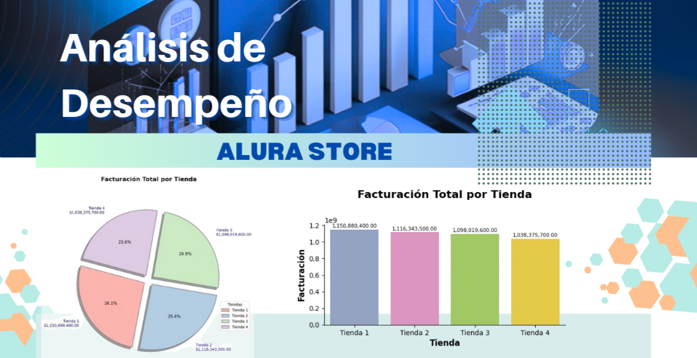
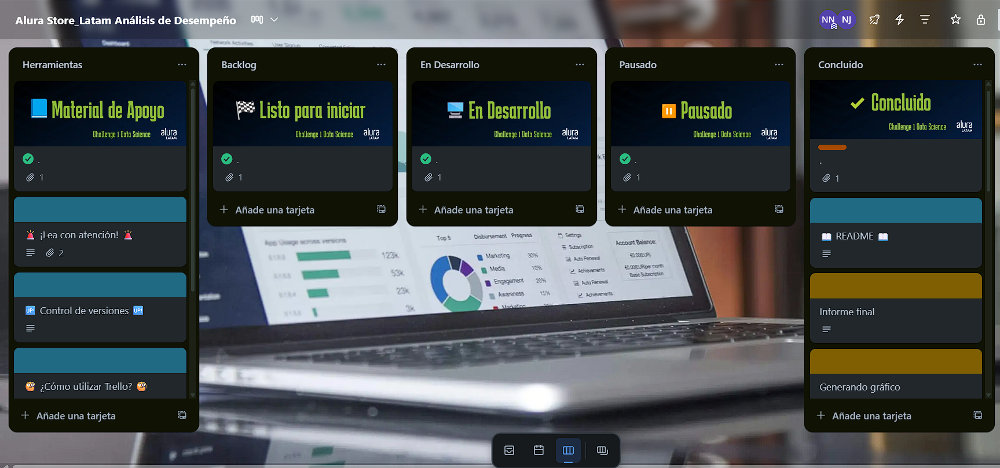
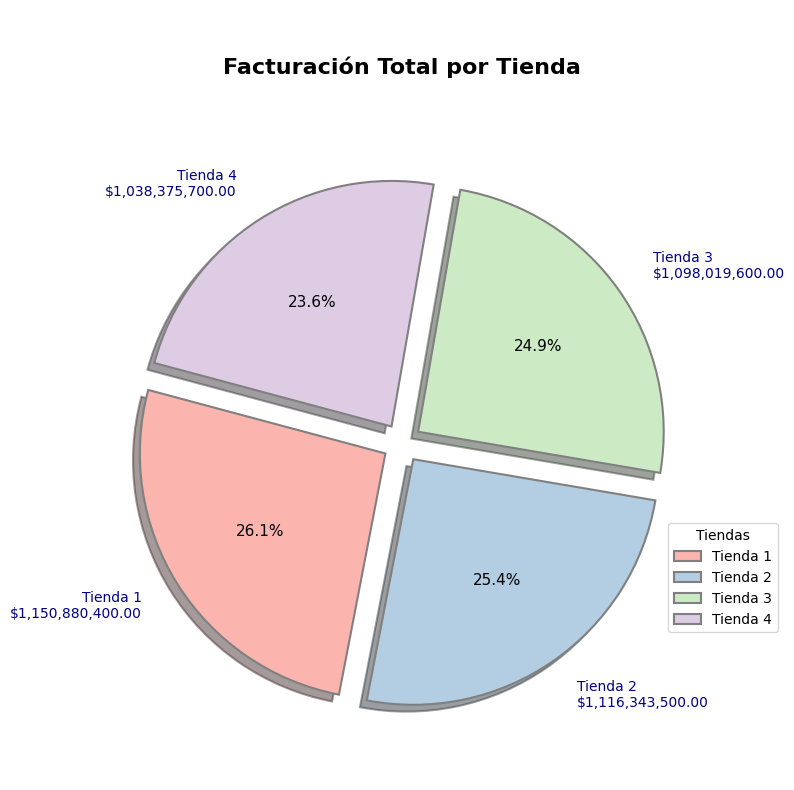
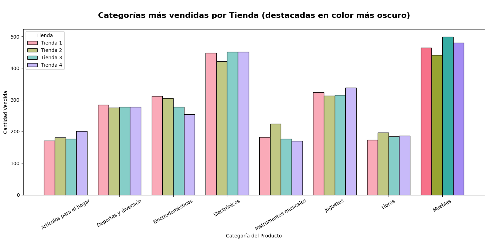
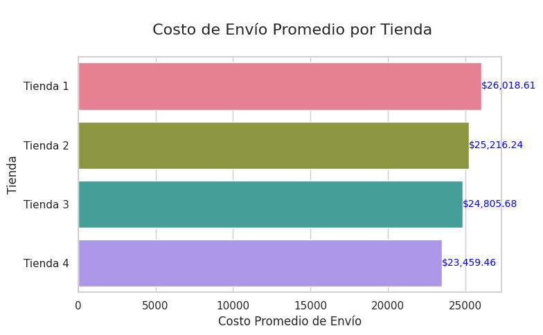

# Evaluación de Desempeño de Tiendas – Análisis para Decisión Estratégica

Este proyecto aplica un enfoque **data-driven** para apoyar la decisión del Sr. Juan sobre cuál de sus cuatro tiendas vender. Se analizan múltiples dimensiones del rendimiento de cada tienda, usando Python y herramientas de análisis de datos para ofrecer una recomendación basada en indicadores clave (KPIs).

---

## Contenido

- [Objetivo del Proyecto](#objetivo-del-proyecto---kpis-analizados)
- [Habilidades y Herramientas Aplicadas](#habilidades-y-herramientas-aplicadas)
- [Gestión del Proyecto con Trello](#gestión-del-proyecto-con-trello)
- [Estructura del Proyecto](#estructura-del-proyecto)
- [Visualizaciones Destacadas](#visualizaciones-destacadas)
- [Instalacion y Ejecucion](#instalacion-y-ejecucion)
- [Instalacion de dependencias](#instalacion-de-dependencias)
- [Como ejecutar el proyecto](#como-ejecutar-el-proyecto)
- [Principales Dependencias](#principales-dependencias)
- [Posibles Problemas](#posibles-problemas)
- [Recomendación Final](#recomendacion-final)
- [Contacto](#contacto)


## Objetivo del Proyecto - KPIs Analizados

Brindar al Sr. Juan una base cuantitativa sólida para decidir cuál de sus tiendas vender y así liberar capital que pueda reinvertir en un nuevo negocio. Se evaluaron las siguientes métricas por tienda:

**- Facturación total por tiendas.**
**- Categorías más populares (por cantidad y facturación).**
**- Evaluación promedio de clientes.**
**- Productos más y menos vendidos.**
**- Costo promedio de envío.**

---

## **Habilidades y Herramientas Aplicadas**


    

- **Python 3.10**
- **Google Colab**
- **Pandas, Numpy, Matplotlib y Seaborn** para análisis y visualización de datos.
- **Data Wrangling**: limpieza y transformación de datos para obtener variables clave.
- **Análisis de desempeño por KPIs**.
- **Interpretación de insights de negocio**.
- **Toma de decisiones basada en datos (enfoque data-driven)**.

> Un enfoque **data-driven** implica que todas las decisiones están fundamentadas en el análisis de datos objetivos. En este caso:
>
>- La decisión sobre qué tienda vender se basa en KPIs claros.
>- No se realizan suposiciones sin respaldo numérico.
>- La recomendación final está alineada con métricas de desempeño.

---

## Gestión del Proyecto con Trello

Para organizar y monitorear el avance de este proyecto se utilizó [Trello](https://trello.com) con una estructura basada en metodología Kanban.  
Se dividió el trabajo en listas: **Herramientas**, **Backlog**, **En Desarrollo**, **Pausado** y **Consluido**, facilitando un flujo claro de tareas y prioridades.

Vista del tablero utilizado:



---

## **Estructura del Proyecto**

```
alura-store/
│
├── README.md
├── informe_final.ipynb (Google Colab)
├── Informe_final.md
├── analisis_datos_alura_store.ipynb
├── data/
|    └── tienda_1.csv
|    └── tienda_2.csv
|    └── tienda_3.csv
|    └── tienda_4.csv
└── images/     ← Gráficos generados desde Colab.
    └── img.png
```

---

## **Visualizaciones Destacadas**







---

## **Instalacion y Ejecucion**

Este proyecto fue desarrollado y ejecutado en Google Colab, no se requiere instalación local.

Puedes optar por estas dos opciones, sigue los pasos que siguen:

### **Opción 1: Abrir en Google Colab (recomendado)**

1. Abre el siguiente enlace:
   
   [Ver análisis en Google Colab](https://colab.research.google.com/drive/1B5_h6rfQ7rygKVgWwpR7z-vH7xH3BaiR)

2. Asegúrate de tener sesión iniciada en tu cuenta Google.

3. Ejecuta las celdas secuencialmente para reproducir todo el análisis y las visualizaciones.

### **Opción 2: Reproducir localmente (opcional)**

**Requisitos Previos**

Asegúrate de tener instalado:

* Python 3.8+
* pip
* Jupyter Notebook (opcional).

---

## **Instalacion de dependencias**

```bash
pip install pandas numpy matplotlib seaborn
```

---

## **Como ejecutar el proyecto**

1. Clona este repositorio:

```bash
git clone https://github.com/NellyCN/alura-store.git
cd alura-store
```

2. Abre el notebook `analisis_datos_alura_store.ipynb` con Jupyter o Colab:

* Opción 1: Sube el archivo a Google Colab

* Opción 2: Ejecuta en Jupyter:

```bash
jupyter notebook
```

---

## **Principales Dependencias**

```python
import pandas as pd
import numpy as np
import matplotlib.pyplot as plt
import seaborn as sns
```

> **Nota: Las librerías ya vienen preinstaladas** en Google Colab, por lo que **no necesitas configurarlas si usas esa plataforma.**

---

## **Posibles Problemas**

|Problema|	Solución|
|--------|------------------------|
|Error al cargar datos desde CSV	| Asegúrate de tener los archivos montados correctamente en Google Colab. Usa `files.upload()` si es necesario.|
|Visualizaciones no aparecen	| Ejecuta la celda correspondiente o usa `%matplotlib inline` si trabajas localmente.|
|Problemas de codificación o tildes |	Asegúrate de usar UTF-8 y verificar el separador correcto (`sep=","` o `sep=";"`) si cargas datos externos.|

---

## **Recomendacion Final**

Luego de realizar un análisis integral, que se detalla en [informe_final.md](informe_final.md), se recomienda vender **la Tienda 4**, considerando que:

- Tiene la **facturación más baja**.
- No lidera en ninguna categorías estratégica.
- Tiene menor satisfacción del cliente.
- Aunque su **costo de envío es el más bajo**, no compensa su bajo rendimiento general.

> **Recomendación complementaria:** Reinvertir el capital liberado en negocios con mayor potencial o fortalecer las tiendas con mejor desempeño (Tiendas 1 y 3).

---